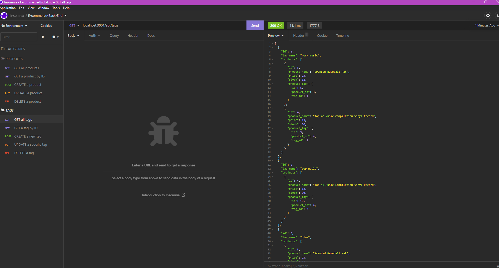
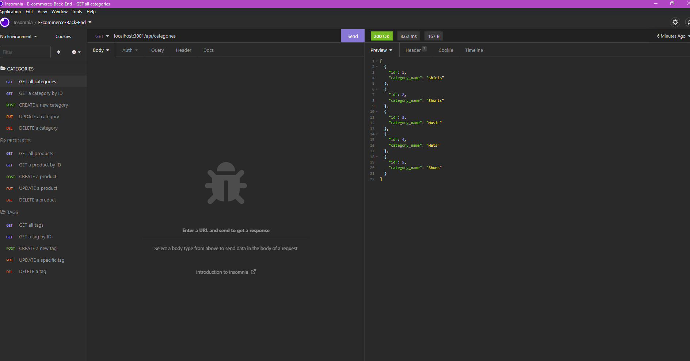

<h1 align="center">E-commerce Back End </h1>

## Description
This is a node.js backend part of an application for an internet retail e-commerce website. It uses Sequelize to interact with the MySQL database.

## Technologies
* JavaScript
* Mysql2
* Sequelize
* Express

## Table of Contents

- [Installation](#installation)
- [Usage](#usage)
- [Screenshot](#screenshot)
- [License](#license)

## User Story
AS A manager at an internet retail company 
I WANT a back end for my e-commerce website that uses the latest technologies 
SO THAT my company can compete with other e-commerce companies

## Acceptance Criteria
GIVEN a functional Express.js API 
WHEN I add my database name, MySQL username, and MySQL password to an environment variable file 
THEN I am able to connect to a database using Sequelize 
WHEN I enter schema and seed commands 
THEN a development database is created and is seeded with test data 
WHEN I enter the command to invoke the application 
THEN my server is started and the Sequelize models are synced to the MySQL database 
WHEN I open API GET routes in Insomnia for categories, products, or tags 
THEN the data for each of these routes is displayed in a formatted JSON 
WHEN I test API POST, PUT, and DELETE routes in Insomnia 
THEN I am able to successfully create, update, and delete data in my database

## Installation
Run npm install to install the required dependencies: dotenv, express, mysql2 & sequelize.

## Usage
Watch walkthrough video by clicking [here](https://drive.google.com/file/d/1kL4CSc1un_3ATrsHeCKUAsGDcc0isGmO/view)

## Screenshots

## License
 
This project is licensed under the MIT License - see the [license info](https://opensource.org/licenses/MIT) for more details.
